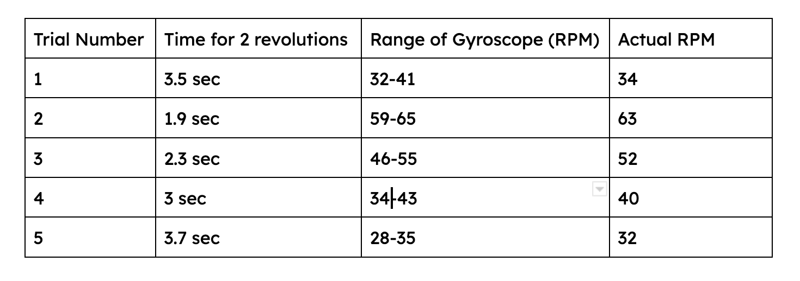
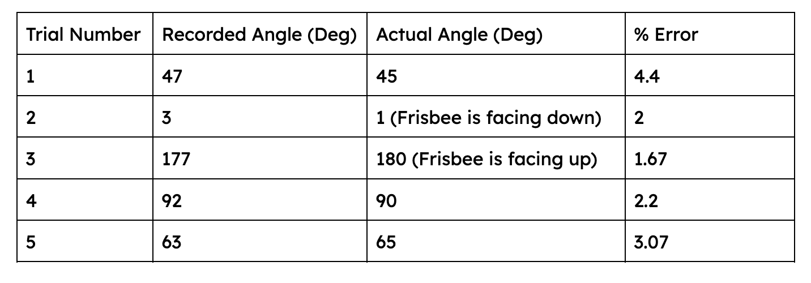
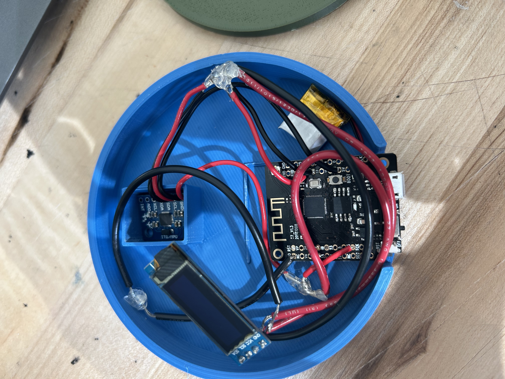
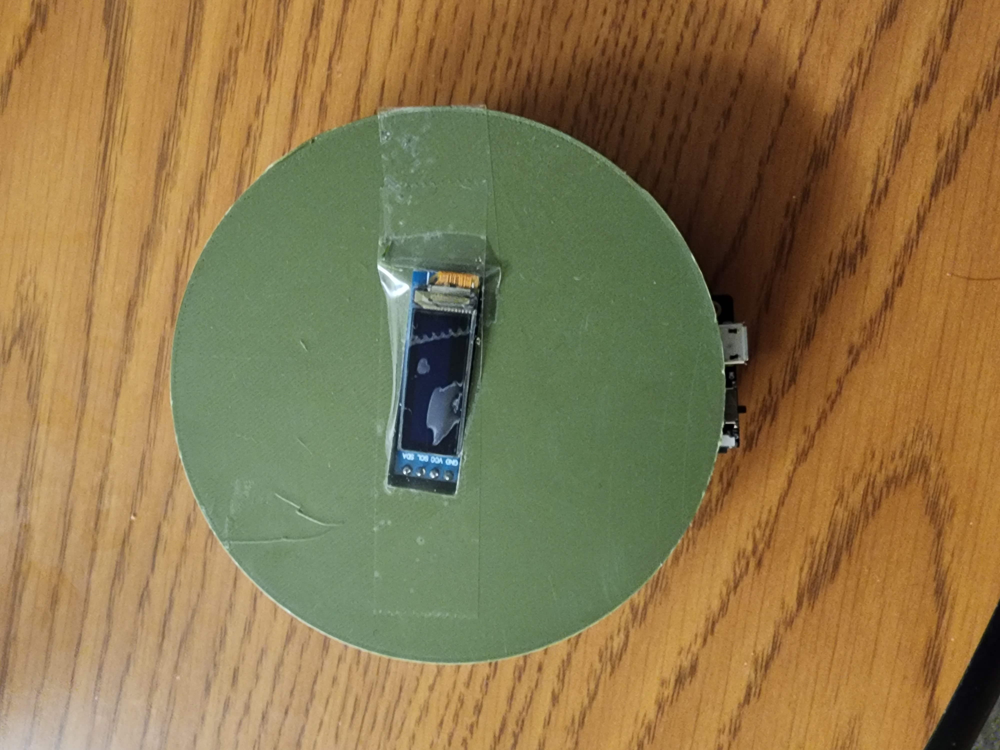
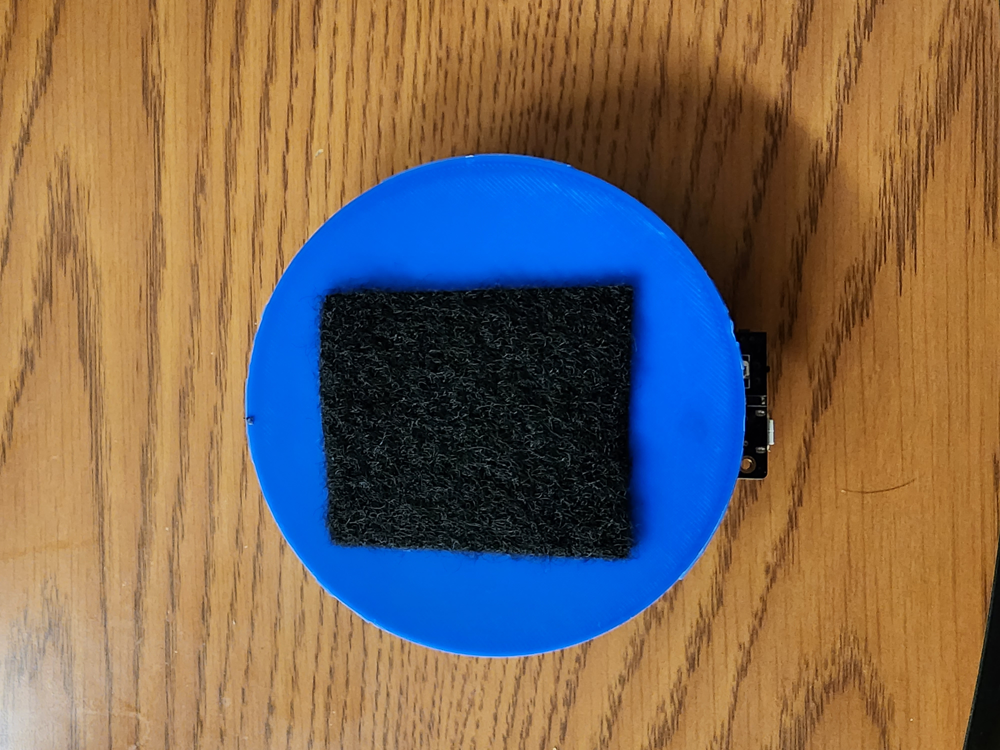
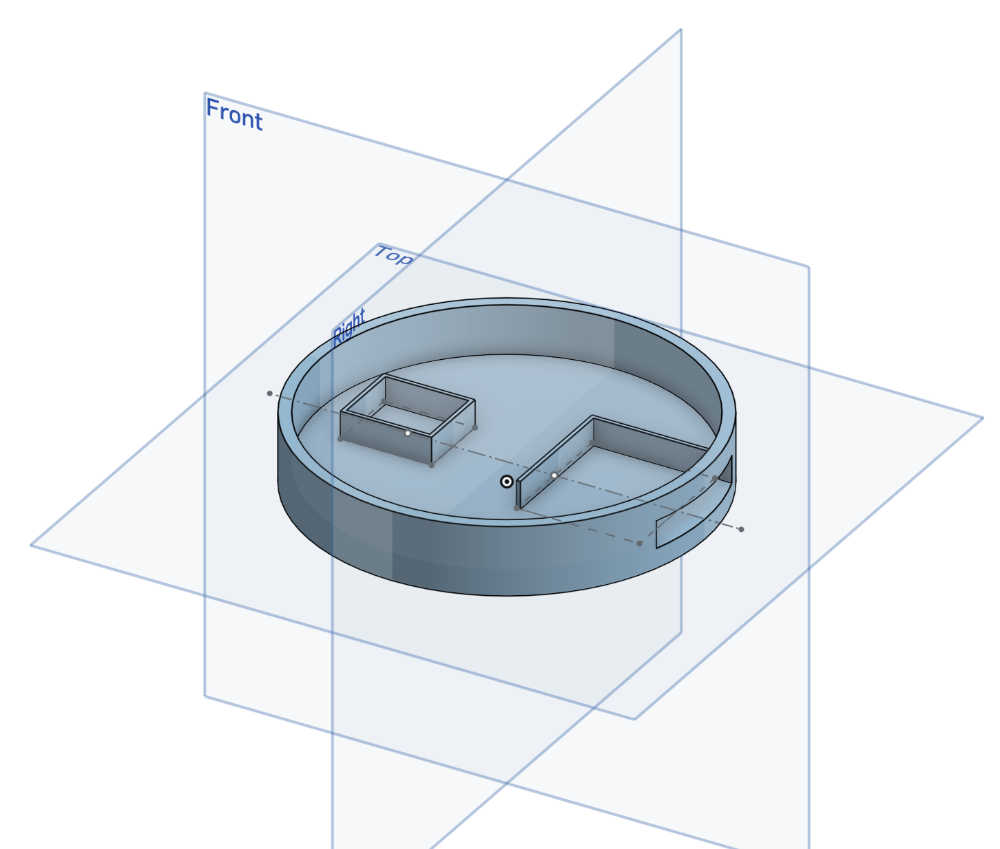

# Homework 7 Report (Design/Build/Use/Test)

### Team K
------

**Challenge 1: Customer Feedback + User Observation**

With this challenge, we will be going over the 2 iteration cycles we went through before reaching our final prototype. These will basically explain the process we went through during each iteration, and the second challenge will provide data and pictures as evidence for the process.

Iteration 1: Initial Encapsulation Design + Displaying Spin & Angle
In this iteration, we designed our first encapsulation for the device, which consists of an ESP32 module, OLED display, and a gyroscope. For the functionality itself, for this iteration, we were able to display the spin at any given moment, and show the angle at any given moment. For us, this was just a starting point. We recognized that although the spin and angle were displaying properly, it did not satisfy our customer’s need, as he wanted the device to calculate the angle at the instance of the throw as well as the max spin of the frisbee itself. We acknowledged this as we talked about it with our customer. As for the device, he provided us with valuable feedback that we could use to redesign the product. There were 2 main deficiencies with the device. The first was that the reset button of the device was too far into the device to reach comfortably. The second concern was that there were gaps in between the top of the device and the bottom, which was attributed to the height of the encapsulation for the gyroscope and ESP32. Since the height was so large, when the wires went over it, it would bulge the top too far from the bottom of the device. So for the next iteration, we aimed to first complete the functionality that met our customer’s needs. Then, we aimed to do a complete redesign of the device encapsulation, so that the wires would completely fit within the bounds of the bottom of the device, and that the reset button, as well as the charging port and on/off switch, would be easier to access.

Iteration 2: Average Angle + Max Spin + New Design
In this iteration, we implemented the functionality of the device to meet our customer’s needs. During testing with our customer, he liked the new design, so we will continue with this onto the next iteration. However, while the max spin was calculated correctly, we noticed that the angle had a very high variability in accuracy. The way the angle was calculated in this iteration was by taking a sample of the average angle over the first 0.5 seconds after a throw. After consulting with our customer, however, he referred us back to original need which was the angle at the instance of the throw, not a couple seconds after the throw. Furthermore, while the angle was correct on some tests, it was highly inaccurate on the others, showing angles like 85 degrees, when the actual angle was around 20 or 30 degrees. From further testing, we figured out that the incorrect readings were a result of 2 things: wind and applied force. The cause for both reasons was due to the way that angle is calculated, on any accelerometer. The angle is calculated by taking the magnitude of all 3 vectors of acceleration and finding the angle between that vector and the az vector, in order to find the tilt angle of the frisbee. So, when the wind hits the frisbee, and slight vibrations occur, it messes with the angle calculated by the accelerometer. Even worse, even the acceleration that we apply to the frisbee at the instance of the throw, affects the angle calculation of the frisbee, since the magnitude of x and y at that instance is so high, which messes with the angle calculation itself. In the final iteration, we will find a way to calculate the angle of the throw right before the throw occurs, to get a better angle calculation. When discussing with our customer about this idea, he was satisfied with the device working this way. The reason for this modification is because the angle calculation is most accurate when there is 0 applied force on the frisbee, and moreover the accelerometer. 

**Challenge 2: System Characterization of Measurable Metrics**

**Iteration 1:**
Below are some of the tests that we ran during iteration 1 to determine if the angle and spin were both displaying accurate values.

Spin Testing:
To demonstrate that our gyroscope function works, we decided to conduct 5 tests. The test was conducted by attaching a long object (hammer) to the frisbee, before rotating the object as uniformly as we could with the handle. Below are the details of each trial; the time was recorded by stopwatch. 

Although the rotation of the frisbee with the long object was not perfect (human error in spinning consistency), the gyroscope range of rpms was still within the acceptable range so that we could declare the gyroscope was still accurate.  Below are GIFs of the first 2 trials, the first one being the fast spin (shot in slow mo for easier visibility of vals) and the second being the slow spin.

Angle Testing: 
To test the angle of the frisbee we conducted 5 tests, finding the actual angle with a protractor and lining up the frisbee with that angle, and using the recorded angle from the device to find the percent error. For the second trial, it was hard to calculate percent error for 0 degrees, so we slightly increased the ground truth angle to 1, and measured from there. Below are the results of the 5 tests. 

Initial Encapsulation Design:
As mentioned above, here is the initial design for the encapsulation. While one of the support structures broke apart before taking this picture, you can clearly see that one, even with the gyroscope support, it is way too high for the wires to entirely go over, and the top piece to fit snugly over it. Secondly, if you see the outline of the support structure for the esp32, it is way too far inside, meaning that it would be difficult to access the reset button, which is vital to the usage of the device.

**Iteration 2:**

First for this iteration, we implemented the new base design, which features an extension outside the inside of the device, for easier access to the charge port, the on/off button, and the reset button. To make sure that the components stay in place, and that the top will never fall off, we hot glued the components inside the device, and superglued the top of the device. 

The device then attached to the frisbee via velcro. During testing, the velcro was strong enough to withstand the impact of the frisbee on the ground, and would not fall off of the frisbee. We made sure of this by chucking the frisbee at the ground, and seeing whether or not the device would fall off. Below is a picture of the final design, as well as the CAD for the bottom of the device.

For the testing of the functionality itself, after we figured from the tests in the first iteration, as well as the first couple trials during the second iteration, the spin and max spin were pretty much producing the same results, and were working as intended. For this reason we decided to heavily test the angle, since before this (previous iteration), we only tested the angle in a stationary situation, not when it was thrown. But with the limitations stated above in challenge 1, the test proved to us that the angle calculation was not working as intended. Below are the results that we gathered from 5 random trials from the many trials that we ran through (most were inaccurate).

Below is a video of the first random trial that we chose. After the first couple trials (like the one shown here, and the other 4 trials listed), we stopped recording videos of the trials since the values being displayed were so far off of even the angles that we could estimate off of just observation. At this point, we decided to go back to the drawing board for the angle calculation code.

**Challenge 3: Final Prototype**

For the final prototype, the main thing we needed to iterate from the previous version was the angle detection. This time, we made it so that the angle will be calculated right before the instance of the throw, so that the applied force from our hands would not affect the detection of the angle. This provided much more accurate results, since the angle was calculated before there was any applied force, yet still satisfying our customer'sneed of getting the angle of the throw at the beginning. With that finished, here is how it works. After you switch the device on, the user will have a timer that counts down from 5, to let them know when to throw. Once the countdown is finished, the user will need to go into their throwing stance in 2 seconds, where the device will calculate the angle. Then, they can throw the frisbee, which is when the max spin will be recorded. Finally the user can go check their frisbee to see the angle of their throw, as well as the max spin. To record again, they can press the reset button located on the bottom left of the device. By achieving an accurate calculation of the maximum spin, as well as the angle at the instance of the throw, we have satisfied our customer's needs. However, we do need to note some of the system's limitations. The first is that in order to receive the most accurate result, the throw can't be made in a fluid motion. Rather, the user needs to go into throwing position, before the angle is detected. Secondly, the device cannot measure more than 333 rpm, because the gyroscope itself can only detect 2000 deg/s of rotation, which is roughly 333 rpm. This is something which is an interesting, but out of scope issue, as through research, we learned that most commercial gyrocopes are within this range, and nothing more. Below is a video of the final prototype in action!

https://drive.google.com/file/d/1chbTFoyrGmR4GrUipraGYlTkuMDpuTuB/view

 
